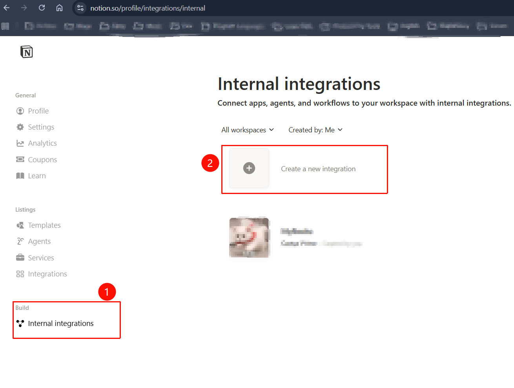
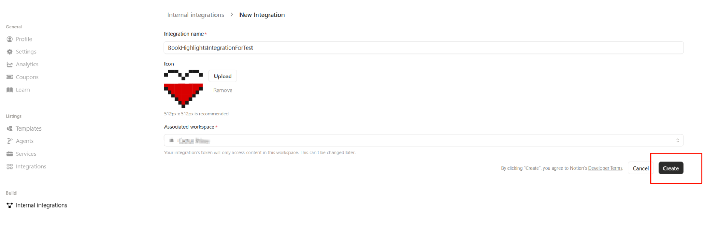
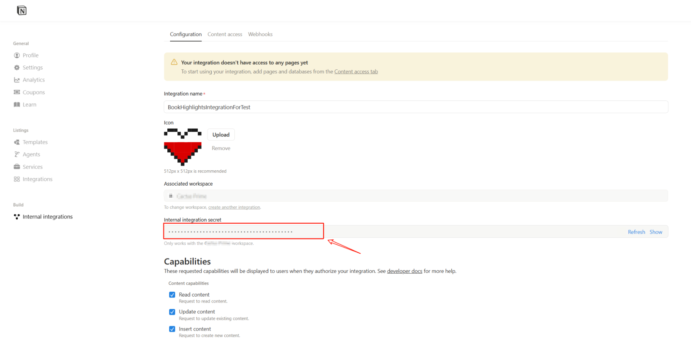
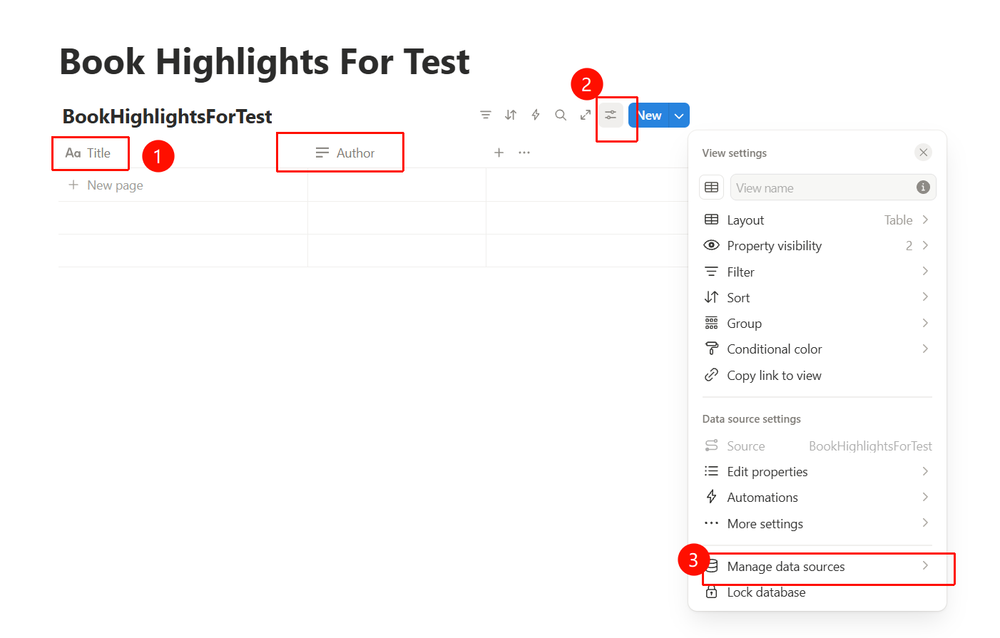
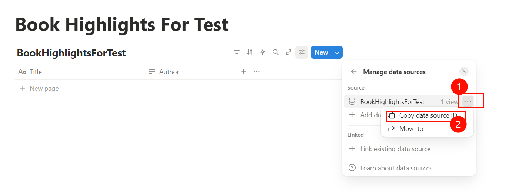
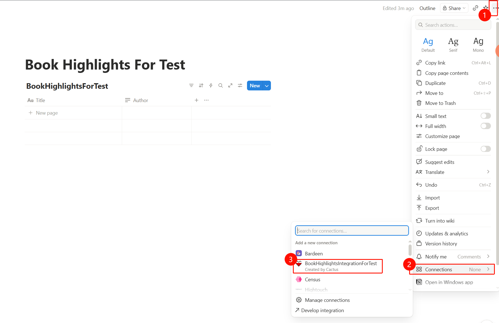
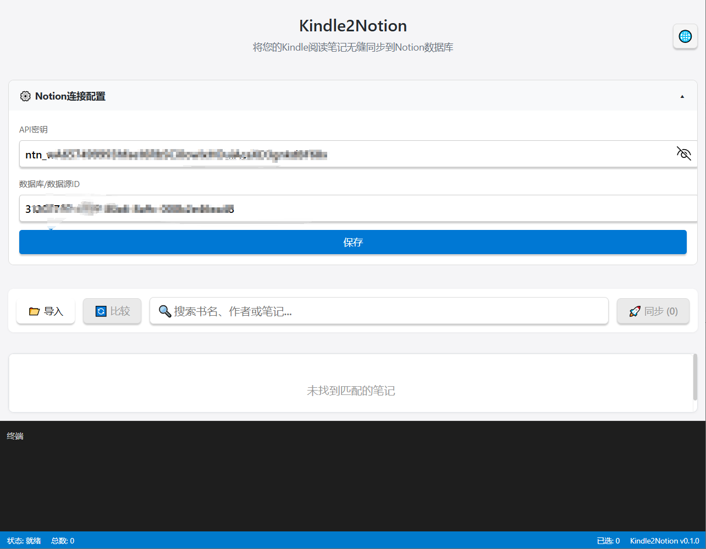
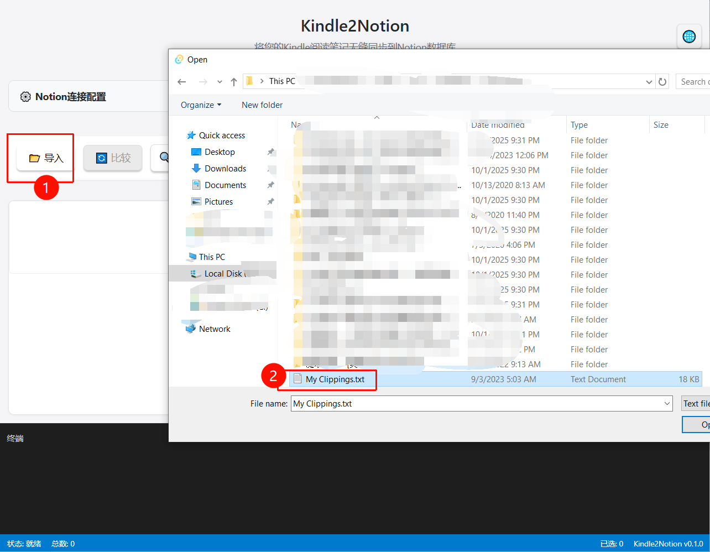
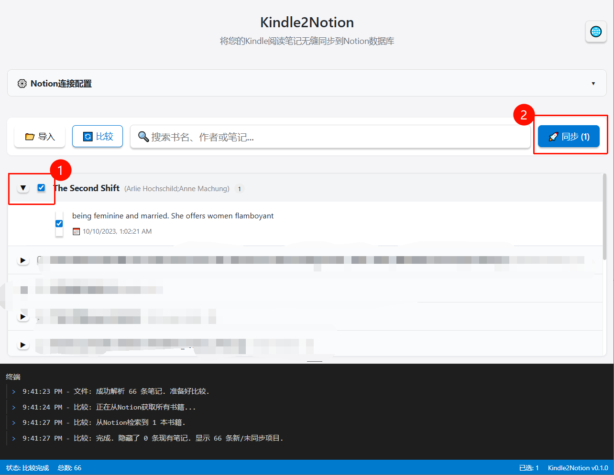

# Kindle2Notion


> A lightweight Windows desktop application designed to seamlessly and incrementally synchronize your Kindle highlights (`My Clippings.txt`) to a Notion database.

[**🇨🇳 中文文档 (Chinese)**](./README_zh.md)

## Features

- **Incremental Sync**: De-duplication ensures only new highlights are uploaded. It compares your local file with Notion data to prevent overwriting or duplicating existing entries.
- **Privacy First**: Runs completely locally on your machine. Your data is sent directly to the Notion API without passing through any third-party servers.
- **Selective Sync**: Review your highlights before syncing. You have full control to select exactly which clips to upload.

## Prerequisites

Before using Kindle2Notion, you need to set up your Notion workspace:

1.  **Get your Notion Integration Token**:
    - Go to [Notion Internal integrations](https://www.notion.so/profile/integrations/internal).
    - Create a new integration and copy the `Internal Integration Secret`.
    
    
    
2.  **Prepare the Database**:
    - Create a new Database in Notion.
    - Ensure your database has at least the following properties:
        - `Title` (Type: Title) - For the book name.
        - `Author` (Type: Text) - For the author's name.
    - Copy the data source ID
    
    
3.  **Authorize the Connection**:
    - Open your Notion Database page.
    - Click the `...` menu in the top right corner -> **Connections**.
    - Search for and select the Integration you created in step 1.
    

## Installation

### Option 1: Download Binary (Recommended)
Visit the **[Releases Page](https://github.com/Sakuraxx/Kindle2Notion/releases)** to download the latest `.exe` installer.

### Option 2: Build from Source
If you are a developer and want to build it yourself:

```bash
# 1. Clone the repository
git clone https://github.com/Sakuraxx/Kindle2Notion.git
cd Kindle2Notion

# 2. Install dependencies
npm install

# 3. Run in development mode
npm run tauri dev

# 4. Build for production
npm run tauri build
```

## How to Use

1.  Enter your **API Key** and **Database ID**, then save.

2.  Click the **"Import"** button to select and open your `My Clippings.txt` file.

3.  Click the **"Compare"** button. The tool will fetch data from Notion, compare it with your local file, and remove duplicates.
4.  Check the boxes for the highlights you want to sync, then click the **"Sync"** button to upload them to Notion.



## Tech Stack
This project is built using a modern, layered architecture:
* Core Framework: [Tauri v2](https://v2.tauri.app/) (Rust-based backend with a web frontend).
* Frontend: React 19 + TypeScript + Vite.
* Key Libraries:
    * `@tauri-apps/plugin-fs & plugin-dialog`: For native file system access.
    * `@notionhq/client`: Official Notion SDK.

##  License
[MIT](https://opensource.org/licenses/MIT) © 2026 Cactus